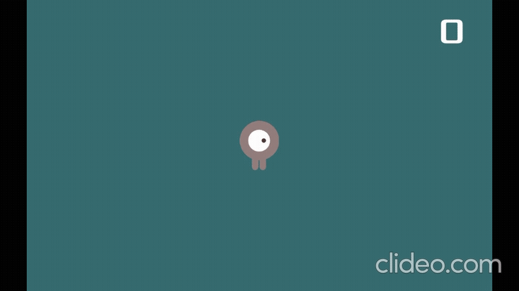

# Первая игра на LeoEcsLite

### Введение

Целью этой статьи является изучение архитектурного паттерна Entity Component Systems на практике. Я подготовил пошаговое руководство по созданию небольшой игры, с помощью которого вы познакомитесь с основными принципами разработки на Ecs. Предполагается что на момент изучения статьи [вы уже ознакомились с идеями паттерна](https://habr.com/ru/articles/665276/) и готовы приступить к практике. Рекомендую также посмотреть [документацию](https://github.com/Leopotam/ecslite#%D0%9E%D1%81%D0%BD%D0%BE%D0%B2%D0%BD%D1%8B%D0%B5-%D1%82%D0%B8%D0%BF%D1%8B) к фреймворку LeoEcsLite.

### Что мы будем делать

Создадим простую игру в которой игроку нужно уворачиваться от врагов и таким образом продержаться 10 секунд.




### Подготовка проекта

Создайте новый Unity проект. Используйте версию не ниже 2021.3

Добавьте в проект пакеты [LeoEcsLite](https://github.com/Leopotam/ecslite), [EcsLiteDi](https://github.com/Leopotam/ecslite-di), [EcsLiteUnityEditor](https://github.com/Leopotam/ecslite-unityeditor), [EcsLiteExtendedSystems](https://github.com/Leopotam/ecslite-extendedsystems).
Для этого откройте папку Packages в корне проекта и добавьте в файл manifest.json четыре строчки

```json
"com.leopotam.ecslite": "https://github.com/Leopotam/ecslite.git",
"com.leopotam.ecslite.di": "https://github.com/Leopotam/ecslite-di.git",
"com.leopotam.ecslite.unityeditor": "https://github.com/Leopotam/ecslite-unityeditor.git",
"com.leopotam.ecslite.extendedsystems": "https://github.com/Leopotam/ecslite-extendedsystems.git",
```

[Cкачайте](https://github.com/AndreyBirchenko/first-ecs-lite-game-tutorial/releases/download/Release/fecsgt-assets.unitypackage) и добавьте пакет с графичесскими ассетами

Импортируйте TextMeshPro. Window → TextMeshPro → Import TMP Essential Resourecs

Если вы сделали всё правильно то у вас появилась папка Game. Внутри неё ещё две папки: Content - место где будут храниться ассеты и пребабы и Runtime место для скриптов.

Зайдите в Runtime, кликните правой кнопкой мыши Create → LeoECSLite → Create Startup from template. Диалоговое окно предложит вам создать иерархию папок, соглашайтесь.

Далее зайдите в Content/Scenes и откройте сцену Startup. Создайте новый гейм объект Startup и добавьте на него скрипт EcsStartup. 

Подготовка завершена. Мы добавили нужные пакеты и создали точку входа с которой будет начинаться игра.

### Предварительный дизайн

Для начала предлагаю набросать небольшой словестный дизайн и описать системы и классы, которые нам понадобятся.

PlayerInputSystem - Обрабатывает пользовательский ввод и устанавливает скорость игрока

MovementSystem - Двигает юнитов по карте

EnemiesSystem - Создаёт вражеских юнитов, также удаляет невидимых юнитов с экрана

ScoreCounterSystem - Считает сколько секунд продержался игрок, обновляет счётчик секунд на экране.

EndGameSystem - Определяет конец игры. Показывает попап “Ты победил” или “Попробуй ещё раз”

>При проектировании систем старайтесь воспринимать их как отдельные фичи, изолированные друг от друга. То есть результаты работы одной системы не должны зависеть от результатов другой. Системы должны иметь возможность работать всегда, а результат их работы зависит только от входных данных. Такой подход очень упрощает изменение и рефакторинг кода.

Также нам потребуются сервисы - классы помошники. Сами по себе они не являются бизнес логикой и используются как “чёрные ящики” чтобы что-то посчитать обработать или доставить данные. Хороший пример сервиса это “поиск пути” вы подаёте на вход две позиции, происходит какая-то магия и сервис возвращает вам путь между ними. 

>Важно понимать что сервисы могут представлять собой ООП классы, которые подключаются в системы. То есть вам не нужно стараться всё писать на Ecs, в некоторых случаях гораздо проще воспользоваться ООП чем придумывать сложную реализацию через системы.

Для нашей простой игры будет создан только один сервис - SceneService.
Эта штука будет проводником игровых объектов из Unity сцены в Ecs системы.

В папке Services создайте скрипт SceneService

```csharp
public class SceneService : MonoBehaviour
{
}
```

На игровой сцене создайте геймобъект SceneService и добавьте на него скрипт.

### Разделение отображения и логики приложения

Вы уже знаете что в ECS данные находятся в компонентах, а бизнес логика в системах, но чтобы пользователь увидел игру её нужно как-то отрисовать. Для этого мы будем использовать  классы “отображения” обычно их именуют с приставкой View. Так как для отображения мы используем Unity эти классы будут наследниками MonoBehaviour.

в папке Game/Runtime/Views создайте UnitView: класс который будет “отрисовывать” всех юнитов в игре.

```csharp
public class UnitView : MonoBehaviour
{
}
```

Добавьте этот скрипт на префаб UnitViewBase он лежит по пути Assets/Game/Content/Prefabs.

### Пользовательский ввод и передвижение

Прежде чем писать логику по обработке ввода и передвижению нам нужна возможность двигать отображение. Добавим классу UnitView метод Move();

```csharp
public class UnitView : MonoBehaviour
{
    public void Move(Vector3 velocity)
    {
        transform.Translate(velocity);
    }
}
```

Также добавим пару методов которые будут менять направление юнита и проигрывать нужную анимацию передвижения

```csharp
public class UnitView : MonoBehaviour
{
    private static readonly int Up = Animator.StringToHash("up");
    private static readonly int Walk = Animator.StringToHash("walk");

    [SerializeField] private SpriteRenderer _spriteRenderer;
    [SerializeField] private Animator _animator;

    public void Move(Vector3 translation)
    {
        transform.Translate(translation);
    }

    public void SetDirection(Vector3 velocity)
    {
        _spriteRenderer.flipX = velocity.x < 0;
        _spriteRenderer.flipY = velocity.y < 0;
    }

    public void UpdateAnimationState(Vector3 velocity)
    {
        _animator.SetBool(Up, velocity.y != 0);
        _animator.SetBool(Walk, velocity.x != 0 && velocity.y == 0);
    }
}
```

Не забудьте открыть префаб UnitViewBase и перетащить SpriteRenderer и Animator в сериализованные поля. Также добавьте префаб PlayerView на игровую сцену

Теперь нам нужно как-то прокинуть PlayerView в системы, сделаем это через SceneService.

Также добавим поле PlayerMoveSpeed чтобы было удобнее регулировать скорость игрока из инспектора.

```csharp
public class SceneService : MonoBehaviour
{
    [field: SerializeField] public UnitView PlayerView { get; private set; }
		[field: SerializeField] public float PlayerMoveSpeed { get; private set; } = 10;
}
```

(сноска инфо)

По ходу статьи мы будем ещё не раз сериализовывать поля. Прошу вас не забывать перетаскивать объекты со сцены в эти поля.

Заинжектим SceneService во все будущие системы. Также уберём ненужные комментарии из класса EcsStartup.

```csharp
sealed class EcsStartup : MonoBehaviour
{
    [SerializeField] private SceneService _sceneService;

    EcsWorld _world;
    IEcsSystems _systems;

    void Start()
    {
        _world = new EcsWorld();
        _systems = new EcsSystems(_world);
        _systems
#if UNITY_EDITOR
                
            .Add(new Leopotam.EcsLite.UnityEditor.EcsWorldDebugSystem())
#endif
            .Inject(_sceneService)
            .Init();
    }
}
```

Теперь можно приступать к обработке пользовательского ввода. 

Для начала создадим компонент, которым будем описывать юнита

```csharp
public struct UnitCmp
{
    public UnitView View;
    public Vector3 Velocity;
}
```

И пустой компонент-тэг по которому будем отличать юнита игрока от всех остальных

```csharp
public struct PlayerTag
{        
}
```

Создадим PlayerInputSystem

```csharp
public class PlayerInputSystem : IEcsRunSystem, IEcsInitSystem
{
		// Инжектим нужные зависимости
    private EcsWorldInject _world;
    private EcsPoolInject<UnitCmp> _unitCmpPool;
    private EcsPoolInject<PlayerTag> _playerTagPool;
    private EcsCustomInject<SceneService> _sceneData;

    private int _playerEntity;

    public void Init(IEcsSystems systems)
    {
        //Создаём сущность игрока
        _playerEntity = _world.Value.NewEntity();

        //Добавляем PlayerTag и UnitCmp на сущность игрока
        _playerTagPool.Value.Add(_playerEntity);
        ref var playerCmp = ref _unitCmpPool.Value.Add(_playerEntity);

        //Прокидываем UnitView в UnitCmp
        playerCmp.View = _sceneData.Value.PlayerView;
    }

    public void Run(IEcsSystems systems)
    {
        //Находим скорость игрока
        var playerMoveSpeed = _sceneData.Value.PlayerMoveSpeed;
        var x = Input.GetAxisRaw("Horizontal");
        var y = Input.GetAxisRaw("Vertical");
        var direction = new Vector3(x, y).normalized;
        var velocity = direction * playerMoveSpeed;

        // Проверяем что на сущности игрока точно есть UnitCmp
        if (!_unitCmpPool.Value.Has(_playerEntity))
            return;

        // Устанавливаем скорость
        ref var playerCmp = ref _unitCmpPool.Value.Get(_playerEntity);
        playerCmp.Velocity = velocity;
    }
}
```

И MovementSystem

```csharp
public class MovementSystem : IEcsRunSystem
{
    private EcsFilterInject<Inc<UnitCmp>> _unitCmpFilter;

    public void Run(IEcsSystems systems)
    {
        //Бежим по всем сущностям с UnitCmp
        foreach (var entity in _unitCmpFilter.Value)
        {
            //Получаем текущую скорость и отображение
            var unitCmp = _unitCmpPool.Value.Get(entity);
            var velocity = unitCmp.Velocity;
            var view = unitCmp.View;

            view.UpdateAnimationState(velocity);

            if (velocity == Vector3.zero)
                continue;

            // Двигаем отображение
            var translation = velocity * Time.deltaTime;
            view.SetDirection(velocity);
            view.Move(translation);
        }
    }
}
```

Не забудьте добавить системы в EcsStartup

```csharp
class EcsStartup
...
void Start()
{
    _world = new EcsWorld();
    _systems = new EcsSystems(_world);
    _systems
        .Add(new PlayerInputSystem())
        .Add(new MovementSystem())
#if UNITY_EDITOR   
        .Add(new Leopotam.EcsLite.UnityEditor.EcsWorldDebugSystem())
#endif
        .Inject(_sceneService)
        .Init();
}
```

Запустите игру и убедитесь в том что юнит двигается.

### Создание врагов

Для того чтобы в игре появились враги, нам нужно спавнить их где-то за пределами экрана, поворачивать в сторону игрока и задавать скорость движения.

Чтобы иметь возможность устанавливать позицию и поворот юниту добавим в UnitView соответствующие методы. Также добавим метод SetActive(). Зачем вы узнаете ниже

```csharp
class UnitView
...
public void SetPosition(Vector3 position)
{
    transform.position = position;
}

public void RotateTo(Vector3 position)
{
    var direction = position - transform.position;
    var angle = Mathf.Atan2(direction.y, direction.x) * Mathf.Rad2Deg;
    var rotation = Quaternion.Euler(0, 0, angle - 90);
    transform.rotation = rotation;
}

public void SetActive(bool state)
{
    gameObject.SetActive(state);
}
```

Враги будут часто создаваться и умирать. Предлагаю делегировать реализацию этого процесса “фабрике врагов“.

Чтобы не плодить классы я добавлю эту логику в SceneService.

```csharp
public class SceneService : MonoBehaviour
{
    [field: SerializeField] public UnitView PlayerView { get; private set; }
    [field: SerializeField] public float PlayerMoveSpeed { get; private set; } = 10;
    [field: SerializeField] public UnitView EnemyViewPrefab { get; private set; }
    
    private ObjectPool<UnitView> _unitsPool;

    private void Awake()
    {
        _unitsPool = new ObjectPool<UnitView>(() => Instantiate(EnemyViewPrefab));
    }

    public UnitView GetEnemy()
    {
        var view = _unitsPool.Get();
        view.SetActive(true);
        return view;
    }

    public void ReleaseEnemy(UnitView view)
    {
        view.SetActive(false);
        _unitsPool.Release(view);
    }
}
```

Также добавим в SceneService несколько полей которые пригодятся при спавне врагов в системе

```csharp
class SceneService

[field: SerializeField] public UnitView PlayerView { get; private set; }
[field: SerializeField] public float PlayerMoveSpeed { get; private set; } = 10;
[field: SerializeField] public UnitView EnemyViewPrefab { get; private set; }
[field: SerializeField] public Camera Camera { get; private set; }
[field: SerializeField] public float EnemyMoveSpeed { get; private set; } = 13;
[field: SerializeField] public float EnemySpawnInterval { get; private set; } = 0.5f;
...
```

Теперь всё готово к тому чтобы написать логику для EnemySystem, но прежде добавьте скрипт UnitView на префаб EnemyView из папки префабов и перетащите его в поле EnemyViewPrefab на сцене. Также не забудьте перетащить камеру.

Начнём с создания метода CreateEnemy

```csharp
public class EnemiesSystem : IEcsInitSystem, IEcsRunSystem
{
    private EcsWorldInject _world;
    private EcsCustomInject<SceneService> _sceneService;
    private EcsPoolInject<UnitCmp> _unitCmpPool;

    private float _spawnInterval;
    private Camera _camera;

    public void Init(IEcsSystems systems)
    {
        _spawnInterval = _sceneService.Value.EnemySpawnInterval;
        _camera = _sceneService.Value.Camera;
    }

    public void Run(IEcsSystems systems)
    {
        CreateEnemy();
    }

    private void CreateEnemy()
    {
				//Заходим в тело метода по таймеру
        if ((_spawnInterval -= Time.deltaTime) > 0)
            return;

        _spawnInterval = _sceneService.Value.EnemySpawnInterval;

				//Создаём View 
        var enemyView = _sceneService.Value.GetEnemy();
        var enemyPosition = GetOutOfScreenPosition();
        enemyView.SetPosition(enemyPosition);
        enemyView.RotateTo(_sceneService.Value.PlayerView.transform.position);

				//Создаём сущность и прокидываем данные
        var enemyEntity = _world.Value.NewEntity();
        ref var unitCmp = ref _unitCmpPool.Value.Add(enemyEntity);
        unitCmp.View = enemyView;
        unitCmp.Velocity = Vector3.up * _sceneService.Value.EnemyMoveSpeed;
    }

    private Vector3 GetOutOfScreenPosition()
    {
        var randomX = Random.Range(-1000, 1000);
        var randomY = Random.Range(-1000, 1000);
        var randomPosition = new Vector3(randomX, randomY);
        var randomDirection = (_camera.transform.position - randomPosition).normalized;
        var cameraHeight = _camera.orthographicSize * 2;
        var cameraWith = cameraHeight * _camera.aspect;
        return new Vector3(randomDirection.x * cameraHeight, randomDirection.y * cameraWith);
    }
}
```

Осталось подключить систему в стартап и проверить что всё работает.

```csharp
class EcsStartup
...
void Start()
{
    _world = new EcsWorld();
    _systems = new EcsSystems(_world);
    _systems
        .Add(new PlayerInputSystem())
        .Add(new MovementSystem())
        .Add(new EnemiesSystem())
#if UNITY_EDITOR
        .Add(new Leopotam.EcsLite.UnityEditor.EcsWorldDebugSystem())
#endif
        .Inject(_sceneService)
        .Init();
}
```

После запуска вы увидите что враги создаются, пролетают игровое пространство, но не умирают. Это не большая проблема для тестовой игры, но раз уж мы сделали создание и удаление врагов через объектный пул, то давайте этим воспользуемся.
Наши враги будут жить 3 секунды, после чего сущность врага будет умирать, а View возвращаться в пул.

Чтобы это реализовать для начала создайте новый компонент

```csharp
public struct LifetimeCmp
{
    public float Value;
}
```

Теперь будем добавлять этот компонент на сущность врага в момент создания и каждый кадр проверять если 3 секунды прошло, то убиваем сущность и возвращаем вьюху в пул.

```csharp
class EnemiesSystem

private EcsWorldInject _world;
private EcsCustomInject<SceneService> _sceneService;
private EcsPoolInject<UnitCmp> _unitCmpPool;
private EcsPoolInject<LifetimeCmp> _lifetimeCmpPool;
private EcsFilterInject<Inc<LifetimeCmp>> _lifetimeFilter;
...
public void Run(IEcsSystems systems)
{
    CreateEnemy();
    CheckEnemyLifetime();
}

private void CreateEnemy()
{
    if ((_spawnInterval -= Time.deltaTime) > 0)
        return;

    _spawnInterval = _sceneService.Value.EnemySpawnInterval;

    var enemyView = _sceneService.Value.GetEnemy();
    var enemyPosition = GetOutOfScreenPosition();
    enemyView.SetPosition(enemyPosition);
    enemyView.RotateTo(_sceneService.Value.PlayerView.transform.position);

    var enemyEntity = _world.Value.NewEntity();

    ref var unitCmp = ref _unitCmpPool.Value.Add(enemyEntity);
    unitCmp.View = enemyView;
    unitCmp.View.Construct(enemyEntity, _world.Value);
    unitCmp.Velocity = Vector3.up * _sceneService.Value.EnemyMoveSpeed;

    ref var lifetimeCmp = ref _lifetimeCmpPool.Value.Add(enemyEntity);
    lifetimeCmp.Value = 3f;
}

private void CheckEnemyLifetime()
{
		//Каждый кадр бежим по всем сущностям с компонентом LifetimeCmp
    foreach (var entity in _lifetimeFilter.Value)
    {
        ref var lifetimeCmp = ref _lifetimeCmpPool.Value.Get(entity);
        lifetimeCmp.Value -= Time.deltaTime;

        if (lifetimeCmp.Value > 0)
            continue;

        ref var unitCmp = ref _unitCmpPool.Value.Get(entity);
        _sceneService.Value.ReleaseEnemy(unitCmp.View);
				
        _world.Value.DelEntity(entity);
    }
}
...
```

Запустите программу и убедитесь что враги пропадают через три секунды после создания.

### Начисление очков

Для реализации механики начисления очков для начала нам потребуется CounterView.

```csharp
public class CounterView : MonoBehaviour
{
    [SerializeField] private TMP_Text _tmp;

    public void SetText(string text)
    {
        _tmp.text = text;
    }
}
```

Добавьте этот скрипт на префаб CounterView из папки Prefabs и перетащите префаб UICanvas на игровую сцену. UICanvas также содержит в себе префаб PopupWindow с ним мы поработаем чуть позже. 

Прокидываем CounterView через SceneService

```csharp
class SceneService
[field: SerializeField] public UnitView PlayerView { get; private set; }
[field: SerializeField] public float PlayerMoveSpeed { get; private set; } = 10;
[field: SerializeField] public UnitView EnemyViewPrefab { get; private set; }
[field: SerializeField] public Camera Camera { get; private set; }
[field: SerializeField] public float EnemyMoveSpeed { get; private set; } = 13;
[field: SerializeField] public float EnemySpawnInterval { get; private set; } = 0.5f;
[field: SerializeField] public CounterView CounterView { get; private set; }
...
```

Создаём ScoreCounterSystem

```csharp
public class ScoreCounterSystem : IEcsInitSystem, IEcsRunSystem
{
    private EcsCustomInject<SceneService> _sceneService;
    private CounterView _counterView;
    private float _timer;
    private int _counterValue;

    public void Init(IEcsSystems systems)
    {
        //Кэшируем View для удобства
        _counterView = _sceneService.Value.CounterView;
        _counterView.SetText("0");
    }

    public void Run(IEcsSystems systems)
    {
        //Каждую секунду обновляем View
        if ((_timer += Time.deltaTime) < 1)
            return;

        _timer = 0;
        _counterValue++;
        _counterView.SetText(_counterValue.ToString());
    }
```

Подключаем систему в стартап и проверяем.

```csharp
class EcsStartup
...
void Start()
{
    _world = new EcsWorld();
    _systems = new EcsSystems(_world);
    _systems
        .Add(new PlayerInputSystem())
        .Add(new MovementSystem())
        .Add(new EnemiesSystem())
        .Add(new ScoreCounterSystem())
#if UNITY_EDITOR
                
        .Add(new Leopotam.EcsLite.UnityEditor.EcsWorldDebugSystem())
#endif
        .Inject(_sceneService)
        .Init();
}
...
```

### Конец игры

Для реализации этой  механики нам нужно проверять два момента. Столкнулся ли персонаж игрока с врагом и прошло ли 10 секунд с начала игры. В зависимости от этих проверок будем показывать попап с надписью “Ты проиграл” или “Ты победил”.

Начнём с создания View скрипта для попапа

```csharp
public class PopupView : MonoBehaviour
{
    [SerializeField] private TMP_Text _descriptionTmp;
    [SerializeField] private TMP_Text _buttonTmp;
    [SerializeField] private GameObject _root;
    [field: SerializeField] public Button Button { get; private set; }

    public void SetDescription(string text)
    {
        _descriptionTmp.text = text;
    }

    public void SetButtonText(string text)
    {
        _buttonTmp.text = text;
    }

    public void SetActive(bool state)
    {
        _root.SetActive(state);
    }
}
```

Добавьте скрипт на префаб PopupView и перетащите нужные зависимости.

Не забудьте пробросить PopupView через SceneService

```csharp
class SceneService
[field: SerializeField] public UnitView PlayerView { get; private set; }
[field: SerializeField] public float PlayerMoveSpeed { get; private set; } = 10;
[field: SerializeField] public UnitView EnemyViewPrefab { get; private set; }
[field: SerializeField] public Camera Camera { get; private set; }
[field: SerializeField] public float EnemyMoveSpeed { get; private set; } = 13;
[field: SerializeField] public float EnemySpawnInterval { get; private set; } = 0.5f;
[field: SerializeField] public CounterView CounterView { get; private set; }
[field: SerializeField] public PopupView PopupView { get; private set; }

...
```

Теперь давайте реализуем коллизию объектов. Unity любезно предоставляет нам метод OnCollisionEnter2D, но как передать информацию о коллизии в системы?

Создадим новый компонент CollisionEvt и будем использовать его в качестве ивента. Он то и передаст информацию о коллизии будущей EndGameSystem.

```csharp
public struct CollisionEvt
{
    public int CollidedEntity;
}
```

Чтобы отправить ивент из UnitView нам понадобится мир, в который мы отправляем ивент, и сущность юнита. Прокинем их в UnitView с помощью метода Construct()

```csharp
class UnitView
...
private int _entity;
private EcsWorld _world;

public void Construct(int entity, EcsWorld world)
{
    _entity = entity;
    _world = world;
}
...
```

Теперь когда произойдёт коллизия мы можем отправить событие CollisionEvt.

```csharp
class UnitView
...
private int _entity;
private EcsWorld _world;

public void Construct(int entity, EcsWorld world)
{
    _entity = entity;
    _world = world;
}

private void OnCollisionEnter2D(Collision2D other)
{
    var entity = _world.NewEntity();
    var pool = _world.GetPool<CollisionEvt>();
    ref var evt = ref pool.Add(entity);
    evt.CollidedEntity = _entity;
}
...
```

Не забудьте вызвать метод Construct() в момент создания сущности юнита.

```csharp
class PlayerInputSystem
...
public void Init(IEcsSystems systems)
{
    _playerEntity = _world.Value.NewEntity();
    _playerTagPool.Value.Add(_playerEntity);
    ref var playerCmp = ref _unitCmpPool.Value.Add(_playerEntity);
    playerCmp.View = _sceneData.Value.PlayerView;
    playerCmp.View.Construct(_playerEntity, _world.Value);
}
...
class EnemiesSystem
...
private void CreateEnemy()
{
    if ((_spawnInterval -= Time.deltaTime) > 0)
        return;

    _spawnInterval = _sceneService.Value.EnemySpawnInterval;

    var enemyView = _sceneService.Value.GetEnemy();
    var enemyPosition = GetOutOfScreenPosition();
    enemyView.SetPosition(enemyPosition);
    enemyView.RotateTo(_sceneService.Value.PlayerView.transform.position);

    var enemyEntity = _world.Value.NewEntity();

    ref var unitCmp = ref _unitCmpPool.Value.Add(enemyEntity);
    unitCmp.View = enemyView;
    unitCmp.Velocity = Vector3.up * _sceneService.Value.EnemyMoveSpeed;
    unitCmp.View.Construct(enemyEntity, _world.Value);

    ref var lifetimeCmp = ref _lifetimeCmpPool.Value.Add(enemyEntity);
    lifetimeCmp.Value = 3f;
}
...
```

Создадим EndGameSystem и добавим проверку на проигрыш

```csharp
public class EndGameSystem : IEcsRunSystem
{
    private EcsFilterInject<Inc<CollisionEvt>> _collisionsEvtFilter;
    private EcsPoolInject<CollisionEvt> _collisionsEvtPool;
    private EcsPoolInject<PlayerTag> _playerTagPool;

    public void Run(IEcsSystems systems)
    {
        CheckLooseCondition();
    }

    private void CheckLooseCondition()
    {
        foreach (var entity in _collisionsEvtFilter.Value)
        {
            ref var collisionEvt = ref _collisionsEvtPool.Value.Get(entity);
            var collidedEntity = collisionEvt.CollidedEntity;

            if (!_playerTagPool.Value.Has(collidedEntity))
                continue;

            Debug.Log("Ты проиграл");
        }
    }
}
```

Добавим систему в стартап и проверим что всё работает как задумано.

```csharp
class EcsStartup
...
void Start()
{
    _world = new EcsWorld();
    _systems = new EcsSystems(_world);
    _systems
        .Add(new PlayerInputSystem())
        .Add(new MovementSystem())
        .Add(new EnemiesSystem())
        .Add(new ScoreCounterSystem())
        .Add(new EndGameSystem())
#if UNITY_EDITOR       
        .Add(new Leopotam.EcsLite.UnityEditor.EcsWorldDebugSystem())
#endif
        .Inject(_sceneService)
        .Init();
}
```

После того как вы запустите игру и вражеский юнит столкнётся с юнитом игрока вы увидите в консоли очень много сообщений “Ты проиграл”, хотя ожидаем мы по одному сообщению после каждого столкновения. Почему так?

Дело в том что “отправка ивента” ничто иное как просто создание новой сущности с компонентом в мире. Чтобы это действительно работало как ивент нам нужно удалять все компоненты до конца кадра. Для этого мы можем использовать метод DelHere<T>()

```csharp
class EcsStartup
...
void Start()
{
    _world = new EcsWorld();
    _systems = new EcsSystems(_world);
    _systems
        .Add(new PlayerInputSystem())
        .Add(new MovementSystem())
        .Add(new EnemiesSystem())
        .Add(new ScoreCounterSystem())
        .Add(new EndGameSystem())
        .DelHere<CollisionEvt>()
#if UNITY_EDITOR
        .Add(new Leopotam.EcsLite.UnityEditor.EcsWorldDebugSystem())
#endif
        .Inject(_sceneService)
        .Init();
}
```

Если вы запустите игру сейчас, то увидите по одному сообщению “Ты проиграл” на каждую коллизию.

Хорошо, теперь давайте дадим игроку возможность выиграть. Для этого всего лишь будем проверять что с начала игры прошло 10 секунд

```csharp
class EndGameSystem
...
public void Run(IEcsSystems systems)
{
    CheckLooseCondition();
    CheckWinCondition();
}

private void CheckWinCondition()
{
    if (Time.timeSinceLevelLoad <= 10)
        return;

    Debug.Log("Ты выиграл");
}
```

Чтобы проверить что это работает отключим пока врагов

```csharp
class EcsStartup
...
void Start()
{
    _world = new EcsWorld();
    _systems = new EcsSystems(_world);
    _systems
        .Add(new PlayerInputSystem())
        .Add(new MovementSystem())
        //.Add(new EnemiesSystem())
        .Add(new ScoreCounterSystem())
        .Add(new EndGameSystem())
        .DelHere<CollisionEvt>()
#if UNITY_EDITOR
        .Add(new Leopotam.EcsLite.UnityEditor.EcsWorldDebugSystem())
#endif
        .Inject(_sceneService)
        .Init();
}
```

Если вы запустите игру и подождёте 10 секунд, то увидите в консоли очень много надписей “Ты выиграл”, но нам нужно заходить в этот метод только один раз, давайте это исправим.

Создадим булевую переменную GameIsOver. Сделаем это в классе SceneService чтобы иметь к ней доступ из любой системы.

```csharp
class SceneService
...
public bool GameIsOver { get; set; }
...
```

Теперь выставляем её в true, когда игрок победил или проиграл и больше не заходим в проверки.

```csharp
class EndGameSystem
...
public void Run(IEcsSystems systems)
{
    if (_sceneService.Value.GameIsOver)
        return;

    CheckLooseCondition();
    CheckWinCondition();
}

private void CheckLooseCondition()
{
    foreach (var entity in _collisionsEvtFilter.Value)
    {
        ref var collisionEvt = ref _collisionsEvtPool.Value.Get(entity);
        var collidedEntity = collisionEvt.CollidedEntity;

        if (!_playerTagPool.Value.Has(collidedEntity))
            continue;

        _sceneService.Value.GameIsOver = true;
				Debug.Log("Ты проиграл");
    }
}

private void CheckWinCondition()
{
    if (Time.timeSinceLevelLoad <= 10)
        return;

    _sceneService.Value.GameIsOver = true;
    Debug.Log("Ты выиграл");
}
```

Игра уже почти готова. Осталось показать попап и исправить мелкие баги. Давайте начнём с багов. Во первых когда игра заканчивается нам нужно перестать спавнить врагов и остановить их движение. Для этого добавим метод StopAllUnits() в EndGameSystem и проверку на конец игры в EnemiesSystem

```csharp
class EndGameSystem
...
private void CheckLooseCondition()
{
    foreach (var entity in _collisionsEvtFilter.Value)
    {
        ref var collisionEvt = ref _collisionsEvtPool.Value.Get(entity);
        var collidedEntity = collisionEvt.CollidedEntity;

        if (!_playerTagPool.Value.Has(collidedEntity))
            continue;

        _sceneService.Value.GameIsOver = true;
        Debug.Log("Ты проиграл");
        StopAllUnits();
    }
}

private void CheckWinCondition()
{
    if (Time.timeSinceLevelLoad <= 10)
        return;

    _sceneService.Value.GameIsOver = true;
    Debug.Log("Ты выиграл");
    StopAllUnits();
}

private void StopAllUnits()
{
    foreach (var entity in _unitCmpFilter.Value)
    {
        _unitCmpFilter.Pools.Inc1.Del(entity);
    }
}
...

class EnemiesSystem
...
public void Run(IEcsSystems systems)
{
    if (_sceneService.Value.GameIsOver)
        return;
    CreateEnemy();
    CheckEnemyLifetime();
}
```

Также нужно остановить таймер

```csharp
class ScoreCounterSystem
...
public void Run(IEcsSystems systems)
{
    if (_sceneService.Value.GameIsOver)
        return;

    if ((_timer += Time.deltaTime) < 1)
        return;

    _timer = 0;
    _counterValue++;
    _counterView.SetText(_counterValue.ToString());
}
```

Ну и наконец давайте покажем попап

```csharp
class EndGameSystem
...
private void CheckLooseCondition()
{
    foreach (var entity in _collisionsEvtFilter.Value)
    {
        ref var collisionEvt = ref _collisionsEvtPool.Value.Get(entity);
        var collidedEntity = collisionEvt.CollidedEntity;

        if (!_playerTagPool.Value.Has(collidedEntity))
            continue;

        _sceneService.Value.GameIsOver = true;
        StopAllUnits();
        ShowEndGamePopup("Ты проиграл");
    }
}

private void CheckWinCondition()
{
    if (Time.timeSinceLevelLoad <= 10)
        return;

    _sceneService.Value.GameIsOver = true;
    StopAllUnits();
    ShowEndGamePopup("Ты выиграл");
}

private void ShowEndGamePopup(string message)
{
    var popupWindow = _sceneService.Value.PopupView;

    popupWindow.SetActive(true);
    popupWindow.SetDescription(message);
    popupWindow.SetButtonText("Повторить");
    popupWindow.Button.onClick.RemoveAllListeners();
    popupWindow.Button.onClick.AddListener(RestartGame);
}

private void RestartGame()
{
    SceneManager.LoadScene(SceneManager.GetActiveScene().name);
}
```

Не забудьте раскомментировать EnemiesSystem в стартапе и игра готова.

```csharp
class EcsStartup
...
void Start()
{
    _world = new EcsWorld();
    _systems = new EcsSystems(_world);
    _systems
        .Add(new PlayerInputSystem())
        .Add(new MovementSystem())
        .Add(new EnemiesSystem())
        .Add(new ScoreCounterSystem())
        .Add(new EndGameSystem())
        .DelHere<CollisionEvt>()
#if UNITY_EDITOR
        .Add(new Leopotam.EcsLite.UnityEditor.EcsWorldDebugSystem())
#endif
        .Inject(_sceneService)
        .Init();
}
...
```

### Заключение

В этой статье я постарался показать основные приёмы работы с паттерном ECS, надеюсь после прочтения и выполнения заданий вы стали лучше понимать как использовать паттерн и попробуете его в собственной разработке.

Если у вас остались какие-то вопросы вы можете задать их в комментариях или связаться со мной лично.